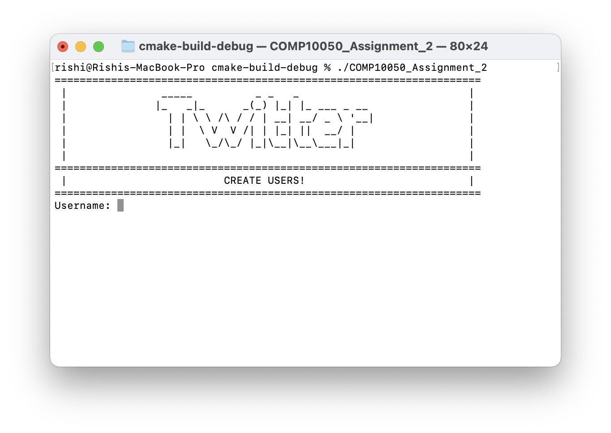
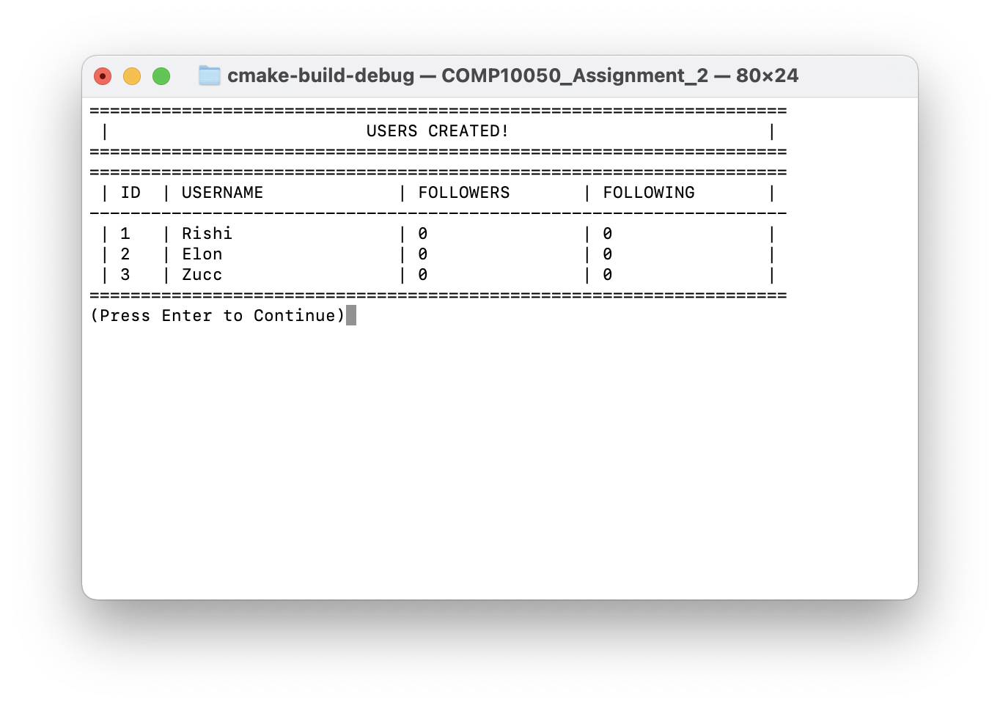

# COMP10050 Assignment 2
## Table of Contents

[TOC]

## Description

A simplified version of Twitter where users can post tweets, follow/unfollow another user, and are able to see the 10 most recent tweets in the user’s news feed.

## Usage

To use the project, simply clone the Github repository with the following command:

```
git clone https://github.com/Rishiry/COMP10050_Assignment_2.git
```

Then, open the folder in *CLion* as a project. Now, simply run the project and you would be prompted with a terminal.

The project can be run directly via the command line by navigating to the *cmake-build-debug* folder and calling the executable file present in there. This is the preferred method of execution as sometimes due to the *CLion* terminal occasionally glitching - specially on Windows. For this method, you will still be required to open the project with CLion at least once and build it, otherwise the *cmake-build-debug* would not be present.

Due to time constraints, we are unable to provide pre-compiled binaries for the project.

## Project Structure

The project was broken down into multiple separate libraries. These libraries were mostly independent and were designed to provide a certain kind functionality each.

In addition to the libraries, certain helper functions were also used. 

### Display Library

For a better user experience, a table like structure was used.  The Display library is responsible for controlling this user interface and rendering the tables. It was initially created to only display tables with a list of all users, however, eventually all grew to contain virtually all outputs that need to be given to the end user.

It is important to note that the library is **hard coded** and would require a major refactor before it could be used in any other project. Since the display library is only part of the entire project, it would be futile to divert resources in an effort to make it more flexible.

#### Hard Coded Constants

```
COLS				Number of Columns in the table displayed
ID_COL				Number of Characters in the ID Column
USERNAME_COL				Number of Characters in the Username Column
FOLLOWERS_COL				Number of Characters in the Followers Column
FOLLOWING_COL				Number of Characters in the Following Column
TOTAL				Number of Characters in the row
LONG_CELL				Number of Characters in a long cell
BORDER				String to be used as border for the table
```

These values are placed in *constants.h*.

#### Example Renders

The library allowed for creation of graphics shown below.





### Twitter Create Library

The Twitter Create Library is responsible for initializing the twitter system and interacting with the end user to create accounts. The code for this library is well commented and the helper functions used are also rather intuitive. The only function this library contains is:

```c
void create_twitter_system(twitter *twitter_system);
```

### Twitter Functions Library

The Twitter Functions Library is the core of the project and is further divided into sub libraries. These sub libraires are responsible for performing a single task each and contain only one function to do so. These single task functions are called by the driver code that exists in *twitter_functions.c* which is responsible for asking the user which function they want to execute. It takes a menu driven approach with an array of functions. The driver function is:

```c
void run_twitter_functions(twitter * twitter_system);
```

The single task functions used are:

```c
void follow(twitter * twitter_system, user * active_user);
void unfollow(twitter * twitter_system, user * active_user);
void get_news_feed(twitter * twitter_system, user * active_user);
void delete(twitter * twitter_system, user * active_user);
void post(twitter * twitter_system, user * active_user);
```

These functions reside in a .c and a corresponding .h file with their names in the same folder as the twitter functions library. Since these functions are in their own files, they aren't exposed to the main function as the driver function will be invoking them.

### Helpers

The helper directory houses miscellaneous functions which are utilized across the project. This includes asking for the user's input, converting an integer to a string, checking if a username is unique etc.

### Utilities

#### Constants

The project made use of certain constant values due to the nature of C. These were all contained in *constants.h* and were reused across the every library. In addition to the constants mentioned under the display library, the following constants were used:

```
COLS				Number of Columns in the table displayed
TWEET_LENGTH				Maximum Length of a Tweet
USR_LENGHT				Maximum Length of Usernames
MAX_FOLLOWERS				Maximum Number of Followers a user can have
MAX_FOLLOWING				Maximum Number of users a user can Follow
MAX_USERS				Maximum Number of users allowed
DISPLAY_TWEETS				Number of tweets to Display
```

The following constant was used in earlier versions of the project, however, was scraped when the Tweets were refactored to be stored in a Linked List instead of an array.

```
MAX_TWEETS				Maximum Number of Tweets allowed
```

#### Structs

Custom structures were used to store and access the working data of the program. The definition of these structures along with their use can be found in *structs.h*. The structures used were:

```
tweet				Used to hold a single tweet. It also holds a pointer to last tweet posted which allows for the traversal of all tweets given only the latest tweet.

user				Used to hold a single user. Contains any information like username or follower count.

twitter				Used as the main data store for project. Contains latest tweet, array of all users etc. Passed down to almost every function so the data can be accessed and modified from any layer of the application - including the main function, the libraries and even the helper functions.
```

